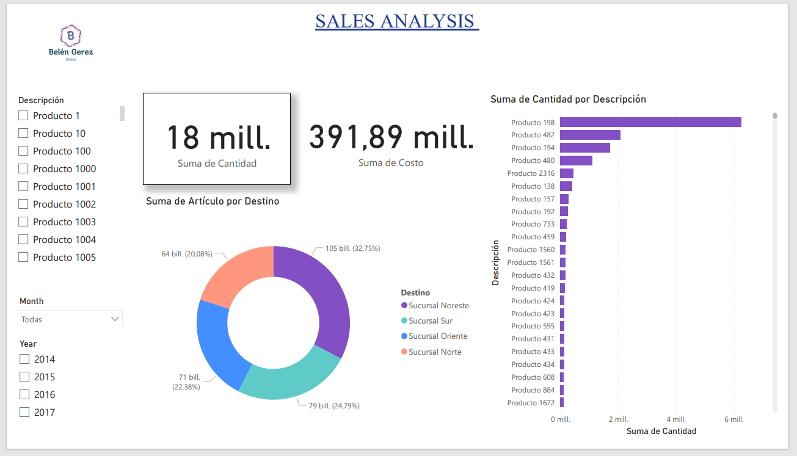

# Analisis de Ventas
Este repositorio contiene un análisis de ventas de diferentes productos basados en sus códigos. El objetivo principal es visualizar la cantidad y el monto de las ventas, así como obtener información sobre las fechas en las que se realizaron.

# Contenido del Repositorio
## visualizations
Esta carpeta contiene las visualizaciones generadas a partir del análisis de ventas. Se proporcionan en formato de imágenes y se dividen en subcarpetas para una organización adecuada.
## Link del Proyecto
[Analisis de Ventas](https://app.powerbi.com/reportEmbed?reportId=eccce566-98e0-4b37-8a77-73e134276aaa&autoAuth=true&ctid=843d9746-0674-48bf-a402-a45cd06f541a)
### Recuerda ingresar con tu cuenta para interacturar 

## Codigo Qr

